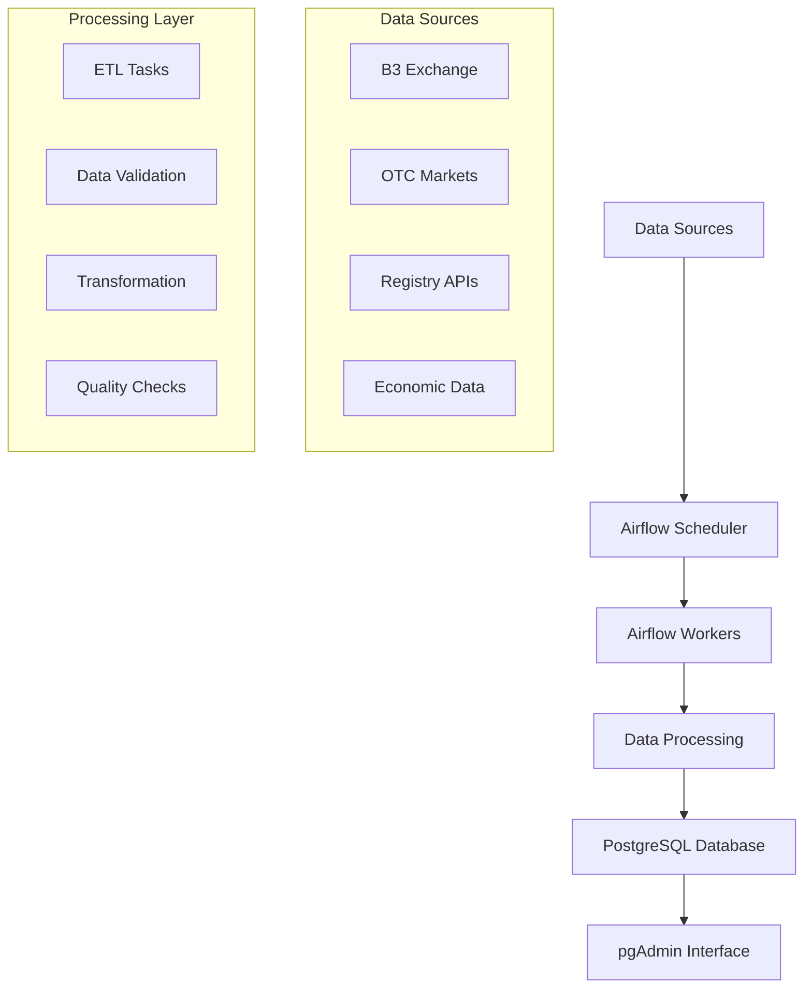

# ticksquay 

[](https://www.repostatus.org/#active)


Scalable ETL pipeline for collecting, transforming, and storing market data from Brazilian and North American financial markets

## 🎯 Overview

The **Market Data Collector** is a robust ETL (Extract, Transform, Load) pipeline designed to handle large-scale financial data ingestion from multiple sources. Built with Apache Airflow and Docker, it provides a scalable solution for collecting market data from:

- **🇧🇷 Brazilian Markets**: B3 Exchange, OTC, and Registry sources
- **🇺🇸 North American Markets**: NYSE, NASDAQ, and derivatives
- **📊 Multiple Data Types**: Equities, bonds, derivatives, macroeconomic indicators

### Key Capabilities

- **Real-time Data Ingestion**: Continuous data collection from multiple APIs
- **Scalable Architecture**: Dockerized microservices with horizontal scaling
- **Data Quality Assurance**: Built-in validation and error handling
- **Future-Ready**: Extensible design for global market expansion

---

## ✨ Features

### 🔄 **ETL Pipeline**
- Apache Airflow orchestration
- Parallel data processing
- Automated scheduling and monitoring
- Data lineage tracking

### 📊 **Data Sources**
- **Exchange Data**: Real-time and historical market data
- **OTC Markets**: Over-the-counter transactions
- **Registry Data**: Securities and regulatory information
- **Macroeconomic**: Economic indicators and rates

### 🛠️ **Technical Stack**
- **Orchestration**: Apache Airflow 2.10.4
- **Containerization**: Docker & Docker Compose
- **Database**: PostgreSQL with pgAdmin
- **Monitoring**: Built-in logging and alerting
- **Automation**: Makefile-based deployment

### 🌐 **Scalability**
- Microservices architecture
- Container orchestration
- Horizontal scaling capabilities
- Cloud-ready deployment

---

## 🏗️ Architecture



---

## 📋 Prerequisites

### System Requirements

| Component | Requirement | Validated Version |
|-----------|-------------|-------------------|
| **RAM** | 8 GB minimum | 12 GB recommended |
| **Storage** | 12 GB free space | SSD recommended |
| **Docker** | v4.37.1+ | v4.37.1 ✅ |
| **Make** | v3.82.90+ | v3.82.90 ✅ |
| **Browser** | Modern browser | For UI access |

### Software Dependencies

- **Docker Desktop**: [Installation Guide](https://docs.docker.com/desktop/)
- **Make**: Platform-specific installation
- **Python**: Included in Docker setup
- **Git**: For version control

### Platform-specific Make Installation

<details>
<summary><strong>🪟 Windows</strong></summary>

```bash
# Option 1: MinGW (Recommended)
# Download from: https://sourceforge.net/projects/mingw/
# Add to PATH: C:\MinGW\bin

# Option 2: Chocolatey
choco install make

# Verify installation
mingw32-make --version
```
</details>

<details>
<summary><strong>🍎 macOS</strong></summary>

```bash
# Pre-installed with Xcode CLI tools
xcode-select --install

# Or via Homebrew
brew install make

# Verify installation
make --version
```
</details>

<details>
<summary><strong>🐧 Linux</strong></summary>

```bash
# Ubuntu/Debian
sudo apt-get install build-essential

# CentOS/RHEL
sudo yum groupinstall "Development Tools"

# Verify installation
make --version
```
</details>

---

## 🚀 Getting Started

### Quick Start Guide

1. **Clone the Repository**
   ```bash
   git clone <repository-url>
   cd market-data-collector
   ```

2. **Configure Environment**
   ```bash
   ./shell/env_config.sh
   ```

3. **Set Up Credentials**
   ```bash
   # Edit .env and data/postgres_mktdata.env
   # Replace PLEASE_FILL and fill@me.com with actual credentials
   ```

4. **Deploy Services**
   ```bash
   make docker_airflow_up
   ```

5. **Access Interfaces**
   - **Airflow**: http://localhost:8080
   - **pgAdmin**: http://localhost:5433

---

## ⚙️ Installation

### Environment Configuration

```bash
# Navigate to project directory
cd complete/path/to/project

# Run environment setup script
./shell/env_config.sh
```

### Configuration Files

Edit the following files with your credentials:

- **`.env`**: Main environment variables
- **`data/postgres_mktdata.env`**: Database credentials

⚠️ **Important**: Replace all `PLEASE_FILL` placeholders and `fill@me.com` examples with actual values.

### Git Bash Path Configuration (Windows)

```bash
# Find mingw32-make location
which mingw32-make

# Add to PATH (example path)
export PATH=$PATH:/c/MinGW/bin

# Verify installation
mingw32-make --version  # Windows
make --version          # macOS/Linux
```

---

## 🧪 Running the Tests

### Pre-deployment Testing

#### 1. Build Environment Tests

```bash
# Test with cache
make test_airflow_env_build

# Test without cache (clean build)
make test_airflow_env_build_no_cache
```

#### 2. Container Validation

```bash
# Verify Airflow container setup
docker run --rm -it apache/airflow:2.10.4 bash

# Inside container, run validation commands:
useradd -m -u 50000 -g root testuser
getent passwd 50000
python --version
whoami
touch /opt/airflow/test.txt
python -c "import stpstone; print(dir(stpstone))"
which airflow
airflow version
```

#### 3. Cleanup Test Environment

```bash
# Remove test containers and images
make test_rm_rmi_airflow_env
```

### Production Testing

#### DAG Validation

```bash
# List all DAGs
airflow dags list

# Check for import errors
airflow dags list-import-errors

# Clear and trigger specific DAG
airflow tasks clear -d -y up2data_b3
airflow dags trigger up2data_b3
```

---

## 🚢 Deployment

### Pre-deployment Checks

```bash
# Verify Docker availability
make check_docker
```

### Production Deployment

#### Option 1: Clean Deployment (Recommended for first-time)

```bash
# Deploy without cache
make docker_airflow_up_no_cache
```

#### Option 2: Cached Deployment

```bash
# Deploy with existing cache
make docker_airflow_up
```

### Database Connection Setup

1. **Access pgAdmin**: Navigate to http://localhost:5433
2. **Login**: Use credentials from `data/postgres_mktdata.env`
3. **Configure Server Connection**:

   <details>
   <summary>Step-by-step Server Configuration</summary>

   **General Tab:**
   - Name: `Market Data DB`

   **Connection Tab:**
   - Host: `postgres_container`
   - Port: `5432`
   - Database: `[your_database_name]`
   - Username: `[your_username]`
   - Password: `[your_password]`

   
   </details>

### Service Management

#### Restart All Services

```bash
# Restart without cache
make docker_airflow_restart_no_cache

# Restart with cache
make docker_airflow_restart
```

#### Individual Service Control

```bash
# Stop all services
docker-compose --env-file .env -f airflow_docker-compose.yml down

# Start specific service
docker-compose --env-file .env -f airflow_docker-compose.yml up [service_name]
```

---

## 📊 Usage

### Accessing the Platform

| Service | URL | Purpose |
|---------|-----|---------|
| **Airflow Webserver** | http://localhost:8080 | DAG management and monitoring |
| **pgAdmin** | http://localhost:5433 | Database administration |
| **Flower** | http://localhost:5555 | Celery task monitoring |

### Common Operations

#### Monitoring DAGs

```bash
# View DAG status
airflow dags state [dag_id] [execution_date]

# Monitor task logs
airflow tasks log [dag_id] [task_id] [execution_date]
```

#### Data Pipeline Operations

```bash
# Trigger manual DAG run
airflow dags trigger [dag_id]

# Pause/Resume DAG
airflow dags pause [dag_id]
airflow dags unpause [dag_id]
```

---

## 🚨 Error Handling

### Logging and Diagnostics

#### Capture Service Logs

```bash
# Export all logs with timestamp
docker compose --env-file .env -f airflow_docker-compose.yml logs > \
  "logs/misc/logs-airflow-docker-compose_$(date +'%Y-%m-%d_%H').txt"
```

#### Network Diagnostics

```bash
# Inspect Docker networks
docker network ls
docker ps
docker images

# Check container network integration
docker network inspect postgres_compose_network

# Test connectivity between containers
docker exec -it pgadmin_container ping postgres_container
```

### Common Issues and Solutions

<details>
<summary><strong>🔧 Container Name Conflicts</strong></summary>

```bash
# Remove conflicting container
docker rm -f airflow-env

# Check for running containers
docker ps -a
```
</details>

<details>
<summary><strong>🔧 Permission Issues</strong></summary>

```bash
# Grant proper permissions
chmod -R 0700 ./data
chown -R $(id -u):$(id -g) ./data
chmod -R 777 dags logs plugins

# Verify permissions
ls -ld ./data

# Fix PostgreSQL data directory
docker exec -it dcs-postgres bash
chmod 0700 /var/lib/postgresql/data
```
</details>

<details>
<summary><strong>🔧 PostgreSQL Permission Errors</strong></summary>

**Error**: `data directory "/var/lib/postgresql/data" has invalid permissions`

**Solution**:
```bash
# Clean data directory
docker run --rm -it -v $(pwd)/postgres:/var/lib/postgresql/data alpine sh
# Inside container:
rm -rf /var/lib/postgresql/*
exit

# Reset permissions
chmod 0700 ./data
```
</details>

### Debug Commands

```bash
# Check container logs
docker logs [CONTAINER_NAME]

# Interactive container access
docker exec -it [CONTAINER_NAME] bash

# Resource usage monitoring
docker stats

# System disk usage
docker system df
```

---

## 🤝 Contributing

We welcome contributions! Please follow these guidelines:

1. **Fork** the repository
2. **Create** a feature branch (`git checkout -b feature/amazing-feature`)
3. **Commit** your changes (`git commit -m 'Add amazing feature'`)
4. **Push** to the branch (`git push origin feature/amazing-feature`)
5. **Open** a Pull Request

### Development Setup

```bash
# Clone your fork
git clone https://github.com/[your-username]/market-data-collector.git

# Create development environment
python -m venv venv
source venv/bin/activate  # Linux/Mac
# or
venv\Scripts\activate     # Windows

# Install development dependencies
pip install -r requirements-dev.txt
```

---

## 🛠️ Built With

### Core Technologies

| Technology | Version | Purpose |
|------------|---------|---------|
| **[Apache Airflow](https://airflow.apache.org/)** | 2.10.4 | Workflow orchestration |
| **[Docker](https://www.docker.com/)** | 4.37.1+ | Containerization |
| **[PostgreSQL](https://www.postgresql.org/)** | Latest | Primary database |
| **[Python](https://www.python.org/)** | 3.12+ | Core development language |

### Supporting Tools

- **[pgAdmin](https://www.pgadmin.org/)**: Database administration
- **[Docker Compose](https://docs.docker.com/compose/)**: Multi-container orchestration
- **[Make](https://www.gnu.org/software/make/)**: Build automation
- **[Git](https://git-scm.com/)**: Version control

### External References

- [Airflow Docker Compose - General](https://airflow.apache.org/docs/apache-airflow/stable/howto/docker-compose/index.html)
- [Airflow Docker Compose - v2.10.4](https://airflow.apache.org/docs/apache-airflow/2.10.4/docker-compose.yaml)
- [Docker Hub](https://hub.docker.com/)

---

## 👨‍💻 Authors

**Guilherme Rodrigues**  
[](https://github.com/guilhermegor)  
[](https://www.linkedin.com/in/guilhermegor/)

---

## 📜 License

This project is licensed under the **MIT License** - see the [LICENSE](LICENSE) file for details.

---

## 🙏 Acknowledgments

- **[stpstone Framework](https://github.com/guilhermegor/stpstone)** - Financial data processing
- **[PurpleBooth](https://gist.github.com/PurpleBooth/109311bb0361f32d87a2)** - README template inspiration

## 📚 Additional Resources

- **[Issue Tracker](https://github.com/[your-repo]/issues)** - Bug reports and feature requests
- **[Discussions](https://github.com/[your-repo]/discussions)** - Community discussions
- **[Changelog](CHANGELOG.md)** - Version history and updates
